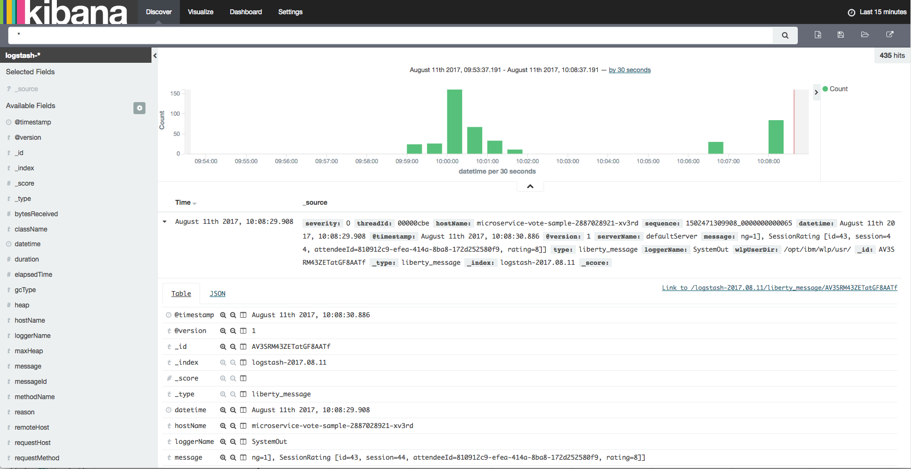

[](https://travis-ci.org/IBM/Java-MicroProfile-on-Kubernetes)

# 将基于 MicroProfile 的 Java 微服务部署到 Kubernetes 上。

*阅读本文的其他语言版本：[English](README.md)。*

本代码将演示如何使用 Kubernetes 上的 MicroProfile 和 Microservice Builder 部署一个基于 Java 的微服务应用程序。

[MicroProfile](http://microprofile.io) 是一个基准平台定义，它针对微服务架构优化了企业 Java，还提供了跨多个 MicroProfile 运行时的应用程序可移植性。[Microservice Builder](https://developer.ibm.com/microservice-builder/) 提供了使用 Java 和基于 MicroProfile 的编程模型和工具来开发、测试和部署微服务的途径。

Microservice Builder [样本应用程序](https://github.com/WASdev/sample.microservicebuilder.docs) 是一个用于管理会议的 Web 应用程序，它基于大量离散的微服务。前端是用 Angular 编写的，后端的微服务是用 Java 编写的。所有部分都是在 Kubernetes 管理的 Docker 容器中的 WebSphere Liberty 上运行。


## 包含的组件
- [Kubernetes 集群](https://console.ng.bluemix.net/docs/containers/cs_ov.html#cs_ov)
- [MicroProfile](http://microprofile.io)
- [Microservice Builder](https://developer.ibm.com/microservice-builder/)
- [IBM Cloud DevOps Toolchain 服务](https://console.ng.bluemix.net/catalog/services/continuous-delivery)
- [IBM Cloud Container 服务](https://console.ng.bluemix.net/catalog/?taxonomyNavigation=apps&category=containers)

## 入门

### Kubernetes

要理解本指南，您需要一个 Kubernetes 集群。如果无法访问现有的 Kubernetes 集群，请按照操作说明（在链接中）提供以下组件之一：

_备注：这些操作说明已在 Kubernetes 1.7.3 上经过测试。  如果您使用的版本比此版本低得多，您获得的收益可能有所不同。_

* [Minikube](https://kubernetes.io/docs/getting-started-guides/minikube)，在您的工作站上
* [IBM Cloud Container 服务](https://github.com/IBM/container-journey-template#container-journey-template---creating-a-kubernetes-cluster)，部署在一个 IBM 管理的集群中（免费的小集群）
* [IBM Cloud Private - 社区版](https://github.com/IBM/deploy-ibm-cloud-private/blob/master/README.md)，用于获得一个自主管理的 Kubernetes 集群（在 Vagrant、Softlayer 或 OpenStack 中）

安装 Kubernetes（或设置对它的访问权）后，通过运行以下命令并确认获得了客户端和服务器的版本响应，确保您能访问它：

```shell
$ kubectl version
Client Version: version.Info{Major:"1", Minor:"7", GitVersion:"v1.7.3", GitCommit:"17d7182a7ccbb167074be7a87f0a68bd00d58d97", GitTreeState:"clean", BuildDate:"2017-08-31T09:14:02Z", GoVersion:"go1.8.3", Compiler:"gc", Platform:"linux/amd64"}
Server Version: version.Info{Major:"1", Minor:"7", GitVersion:"v1.7.3", GitCommit:"17d7182a7ccbb167074be7a87f0a68bd00d58d97", GitTreeState:"clean", BuildDate:"2017-09-18T20:30:29Z", GoVersion:"go1.8.3", Compiler:"gc", Platform:"linux/amd64"}
```

### Helm

一些操作说明利用 Helm 来部署应用程序。如果您没有 
Helm，那么您应该[安装 Helm](https://github.com/kubernetes/helm) 并
在您的 Kubernetes 集群上初始化它：

```shell
$ helm init
$HELM_HOME has been configured at /home/username/.helm.

Tiller (the Helm server-side component) has been installed into your Kubernetes Cluster.
Happy Helming!
```

## 步骤

### 1.安装 Microservice Builder 附加组件

首先，克隆我们的存储库。
```shell
git clone https://github.com/IBM/Java-MicroProfile-on-Kubernetes.git
cd Java-MicroProfile-on-Kubernetes
```

然后，安装 2 个附加组件：
* [Microservice Builder Fabric](https://www.ibm.com/support/knowledgecenter/SS5PWC/fabric_concept.html)
* [ELK 样本](https://github.com/WASdev/sample.microservicebuilder.helm.elk/blob/master/sample_elk_concept.md)

安装 Microservice Builder Fabric：

```shell
$ helm repo add mb http://public.dhe.ibm.com/ibmdl/export/pub/software/websphere/wasdev/microservicebuilder/helm/
$ helm install --name fabric mb/fabric
```

安装 ELK：

```shell
$ helm repo add mb-sample https://wasdev.github.io/sample.microservicebuilder.helm.elk/charts
$ helm install --name sample-elk mb-sample/sample-elk
```

将 Microservice Builder 附加组件安装到您的 Kubernetes 集群上最多需要 20 分钟。如果您想自行[构建该应用程序](docs/build-instructions.md)，现在是一个好时机。但是，出于演示目的，您可以使用我们已经构建并上传到 journeycode docker 存储库的映像。

开始部署您的应用程序之前，请确保 Microservice Builder 附加组件已安装并正常运行。

```shell
$ kubectl get pods --show-all=true
NAME                                    READY     STATUS      RESTARTS   AGE
fabric-zipkin-4284087195-d6s1t          1/1       Running     0          11m
key-retrieval-deploy-gkr9n              0/1       Completed   0          11m  # Make sure this job is completed
kibana-dashboard-deploy-rd0q5           1/1       Running     0          11m
sample-elk-sample-elk-461262821-rp1rl   3/3       Running     0          11m
secret-generator-deploy-bj1jj           0/1       Completed   0          11m  # Make sure this job is completed
```

### 2.可选步骤 - 部署 Istio

如果您想部署并使用 [Istio](https://istio.io/) 来控制微服务之间的流量，可以通过以下命令来部署它：

```shell
$ kubectl create -f istio
namespace "istio-system" created
clusterrole "istio-pilot-istio-system" created
clusterrole "istio-initializer-istio-system" created
clusterrole "istio-mixer-istio-system" created
...
...
initializerconfiguration "istio-sidecar" created
```

### 3.部署微服务

现在，使用以下命令部署微服务：

```shell
$ kubectl create -f manifests
persistentvolume "cloudant-pv" created
persistentvolumeclaim "cloudant-pv-claim" created
service "cloudant-service" created
deployment "cloudant-db" created
...
...
```

_备注：这会将所有 Kubernetes 清单部署到 [manifests/](manifests/) 目录中。花点时间浏览它们的内容，以了解用于部署和公开该应用程序的资源。_

创建所有这些服务和部署后，等待 10 到 15 分钟。您可以在 Kubernetes UI 上检查部署状态。运行”kubectl proxy”并访问 URL”http://127.0.0.1:8001/ui” ，检查应用程序容器何时准备就绪。


几分钟后，您应该就能访问该应用程序。我们的部署包含一个 [Kubernetes 入口资源](manifests/deploy-ingress.yaml)。如果您的 Kubernetes 集群已有一个入口服务，比如 IBM Cloud Private，那么您应该无需执行进一步更改就能访问该应用程序。

但是，如果您使用的是 minikube 或者没有入口服务的 Kubernetes 集群，那么您在访问集群之前还需要执行一个步骤。在 minikube 上，可以执行以下操作：

```shell
$ minikube addons enable ingress
ingress was successfully enabled
$ minikube ip
192.168.99.100
```

启用入口控制器后，您就可以通过上面的 minikube 提供的 IP 访问该应用程序。

现在可以在浏览器上使用链接 **http://[Public IP]** 来访问您的应用程序，并使用 **http://[Public IP]:30500** 访问您的 Kibana 来跟踪指标。

Web 应用程序主页


当您单击发言人姓名时


当您单击日程表链接时


当您单击投票链接时


Kibana 发现页面



## 故障排除

* 如果您的微服务实例未正确运行，可以使用以下命令来检查日志
	* `kubectl logs <your-pod-name>`
* 删除一个微服务
	* `kubectl delete -f manifests/<microservice-yaml-file>`
* 删除所有微服务
	* `kubectl delete -f manifests`
* 删除 istio
  & `kubectl delete -f istio`
* 删除 Microservice Builder 附加组件
  	* `helm delete --purge sample-elk`
  	* `helm delete --purge fabric`

## 参考资料
* 这个 Java 微服务示例基于 Kubernetes 的 [Microprofile 演示应用程序](https://github.com/WASdev/sample.microservicebuilder.docs)。

# 隐私声明

可以配置包含这个包的样本 Kubernetes Yaml 文件来跟踪对 [IBM Cloud](https://www.bluemix.net/) 和其他 Kubernetes 平台的部署。每次部署时，都会将以下信息发送到 [Deployment Tracker](https://github.com/IBM/metrics-collector-service) 服务：

* Kubernetes 集群提供者（`IBM Cloud、Minikube 等`）
* Kubernetes 机器 ID
* Kubernetes 集群 ID（仅来自 IBM Cloud 的集群）
* Kubernetes 客户 ID（仅来自 IBM Cloud 的集群）
* 这个 Kubernetes 作业中的环境变量。

此数据收集自样本应用程序的 yaml 文件中的 Kubernetes 作业。IBM 使用此数据来跟踪与将样本应用程序部署到 IBM Cloud 相关的指标，以度量我们的示例的实用性，让我们可以持续改进为您提供的内容。仅跟踪包含对 Deployment Tracker 服务执行 ping 操作的代码的样本应用程序的部署过程。

## 禁用部署跟踪

请注释掉/删除“manifests/deploy-cloudant.yaml”文件末尾的 Metric Kubernetes Job 部分。
