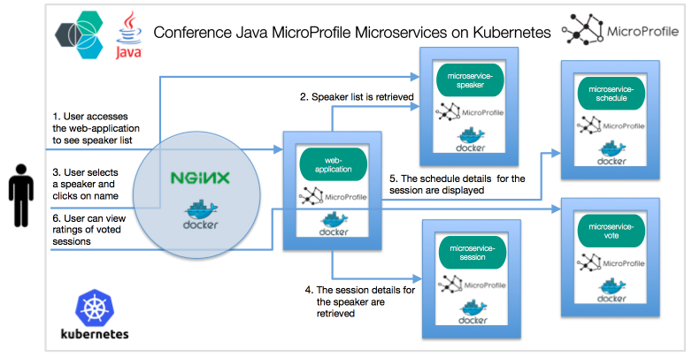

[](https://travis-ci.org/IBM/kubernetes-container-service-java-microprofile-deployment)

# Java microservices using MicroProfile on Bluemix Container Service Kubernetes Cluster

This project demonstrates the deployment of a Java based microservices application using MicroProfile and Microservice Builder on IBM Bluemix Container Service Kubernetes Cluster.

[MicroProfile](http://microprofile.io) is a baseline platform definition that optimizes Enterprise Java for a microservices architecture and delivers application portability across multiple MicroProfile runtimes. [Microservice Builder](https://developer.ibm.com/microservice-builder/) builds on top of MicroProfile.io, and provides extension for containerized apps created using the tool to be deployed to Kubernetes.

The Microservice Builder [sample application](https://github.com/WASdev/sample.microservicebuilder.docs) is a web application for managing a conference and is based on a number of discrete microservices. The front end is written in Angular; the backing microservices are in Java. All run on WebSphere Liberty, in Docker containers managed by Kubernetes.

With [IBM Bluemix Container Service](https://console.ng.bluemix.net/catalog/?taxonomyNavigation=apps&category=containers), you can deploy and manage your own Kubernetes cluster in the cloud that lets you automate the deployment, operation, scaling, and monitoring of containerized apps over a cluster of independent compute hosts called worker nodes.  



## Included Components
- [Bluemix Container Service](https://console.ng.bluemix.net/catalog/?taxonomyNavigation=apps&category=containers)
- [Kubernetes Cluster](https://console.ng.bluemix.net/docs/containers/cs_ov.html#cs_ov)
- [MicroProfile](http://microprofile.io)
- [Microservice Builder](https://developer.ibm.com/microservice-builder/)
- [Bluemix DevOps Toolchain Service](https://console.ng.bluemix.net/catalog/services/continuous-delivery)

## Prerequisite

* Create a Kubernetes cluster with IBM Bluemix Container Service.
If you have not setup the Kubernetes cluster, please follow the [Creating a Kubernetes cluster](https://github.com/IBM/container-journey-template) tutorial.

* Install a Git client to obtain the sample code.
* Install [Maven](https://maven.apache.org/download.cgi) and a Java 8 JDK.
* Install a [Docker](https://docs.docker.com/engine/installation/) engine.


## Deploy to Bluemix
If you want to deploy the wordpress directly to Bluemix, click on 'Deploy to Bluemix' button below to create a Bluemix DevOps service toolchain and pipeline for deploying the WordPress sample, else jump to [Steps](##steps)

[](https://console.ng.bluemix.net/devops/setup/deploy/?repository=https://github.com/IBM/kubernetes-container-service-java-microprofile-deployment)

## Steps

1. [Install Docker CLI and Bluemix Container registry Plugin](#1-install-docker-cli-and-bluemix-container-registry-plugin)
2. [Get and build the application code](#2-get-and-build-the-application-code)
3. [Build application containers](#3-build-application-containers)
4. [Create Services and Deployments](#4-create-services-and-deployments)

# 1. Install Docker CLI and Bluemix Container Registry Plugin


First, install [Docker CLI](https://www.docker.com/community-edition#/download).

Then, install the Bluemix container registry plugin.

```bash
bx plugin install container-registry -r bluemix
```

Once the plugin is installed you can log into the Bluemix Container Registry.

```bash
bx cr login
```

If this is the first time using the Bluemix Container Registry you must set a namespace which identifies your private Bluemix images registry. It can be between 4 and 30 characters.

```bash
bx cr namespace-add <namespace>
```

Verify that it works.

```bash
bx cr images
```


# 2. Get and build the application code

* Install the [Microservice Builder fabric](https://microservicebuilder.mybluemix.net/docs/installing_fabric_task.html) - these are various services that run on top of Kubernetes.
* `git clone` the following projects:
   1. [sample.microservicebuilder.web-app](https://github.com/WASdev/sample.microservicebuilder.web-app)
   1. [sample.microservicebuilder.vote](https://github.com/WASdev/sample.microservicebuilder.vote)
   1. [sample.microservicebuilder.schedule](https://github.com/WASdev/sample.microservicebuilder.schedule)
   1. [sample.microservicebuilder.speaker](https://github.com/WASdev/sample.microservicebuilder.speaker)
   1. [sample.microservicebuilder.session](https://github.com/WASdev/sample.microservicebuilder.session)

* `mvn clean package` in each ../sample.microservicebuilder.* projects


# 3. Build application containers

Use the following commands to build the microservers containers.

Build the web-app microservice container

```bash
cd sample.microservicebuilder.web-app
docker build -t registry.ng.bluemix.net/<namespace>/microservice-webapp .
docker push registry.ng.bluemix.net/<namespace>/microservice-webapp
```

Build the vote microservice container

```bash
cd sample.microservicebuilder.vote
docker build -t registry.ng.bluemix.net/<namespace>/microservice-vote .
docker push registry.ng.bluemix.net/<namespace>/microservice-vote
```

Build the schedule microservice container

```bash
cd sample.microservicebuilder.schedule
docker build -t registry.ng.bluemix.net/<namespace>/microservice-schedule .
docker push registry.ng.bluemix.net/<namespace>/microservice-schedule
```

Build the speaker microservice container

```bash
cd sample.microservicebuilder.speaker
docker build -t registry.ng.bluemix.net/<namespace>/microservice-speaker .
docker push registry.ng.bluemix.net/<namespace>/microservice-speaker
```

Build the session microservice container

```bash
cd sample.microservicebuilder.session
docker build -t registry.ng.bluemix.net/<namespace>/microservice-session .
docker push registry.ng.bluemix.net/<namespace>/microservice-session
```

Build the nginx controller

```bash
cd nginx
docker build -t registry.ng.bluemix.net/<namespace>/nginx-server .
docker push registry.ng.bluemix.net/<namespace>/nginx-server
```

# 4. Create Services and Deployments

Change the image name given in the respective deployment YAML files for  all the projects in the manifests directory with the newly build image names.

Get the public ip of the node

```bash
$ kubectl get nodes
NAME             STATUS    AGE
169.47.241.106   Ready     23h
```
Set the value of `SOURCE_IP` env variable present in deploy-nginx.yaml file present in manifests folder with the public ip of the node.

Deploy the microservice from the manifests directory with the command `kubectl create -f <filename>`.

After you have created all the services and deployments, wait for 10 to 15 minutes. You can check the status of your deployment on Kubernetes UI. Run 'kubectl proxy' and go to URL 'http://127.0.0.1:8001/ui' to check when the application containers are ready.


After few minutes the following commands to get your public IP and NodePort number.

```bash
$ kubectl get nodes
NAME             STATUS    AGE
169.47.241.106   Ready     23h
$ kubectl get svc nginx-svc
NAME        CLUSTER-IP     EXTERNAL-IP   PORT(S)        AGE
nginx-svc   10.10.10.167   <nodes>       80:30056/TCP   11s
```

Now you can use the link **http://[IP]:30056** to access your application on browser.

Web application home page


When you click on speaker name


When you click on schedules link


When you click on vote link


# Toolchain instructions

> Note: This toolchain instruction is based on this [tutorial](https://developer.ibm.com/recipes/tutorials/deploy-kubernetes-pods-to-the-bluemix-container-service-using-devops-pipelines).

1. Click the Create [toolchain button](https://console.ng.bluemix.net/devops/setup/deploy/?repository=https://github.com/IBM/kubernetes-container-service-scalable-wordpress-deployment) to fork the repo into your GitHub account.

2. If you have not authenticated to GitHub you will see an Authorize button.

3. Once the repository is forked, you will be taken to the Bluemix Continuous Delivery toolchain setup. This toolchain has been defined by the template in the sample repository.

4. Click the Create button. This will generate a toolchain that looks like the following:


5. Select the Delivery Pipeline tile from the toolchain view to open the pipeline stages view.

6. The pipeline executes immediately after being created. The Deploy stage will fail on the first run because we are missing your account information for authentication. Click on the gear at the top right corner of the Deploy stage to select Configure Stage.


7. Set the following environment properties

    BLUEMIX_USER – your Bluemix user ID.

    BLUEMIX_PASSWORD – your Bluemix password.

    BLUEMIX_ACCOUNT – The GUID of the Bluemix account where you created the cluster. Retrieve it with `bx iam accounts`.

    CLUSTER_NAME – Your cluster name. Retrieve it with `bx cs clusters`.

> Note: For federated id user, since you can't login with Bluemix user and password via Bluemix CLI, you need to obtain an Apikey for login via https://console.ng.bluemix.net/docs/containers/cs_troubleshoot.html#cs_federated_id. Once you have your APIkey, click **add property** under environment properties. Then add a new property called `API_KEY` and set it to your APIkey.


8. Run the Deploy stage using the Run Stage button at the top righthand side of the stage’s card. This time the Deploy stage will succeed and the Java microservices using MicroProfile will be deployed.


9. Click **View logs and history** of the Deploy stage to find the URL of the Java microservices using MicroProfile appplication.

10. Congratulation, you can click the Java microservices using MicroProfile link to load the application in your browser. Note it takes a few seconds from the time the pods deploy until they are ready to serve requests.


# License
[Apache 2.0](LICENSE)
