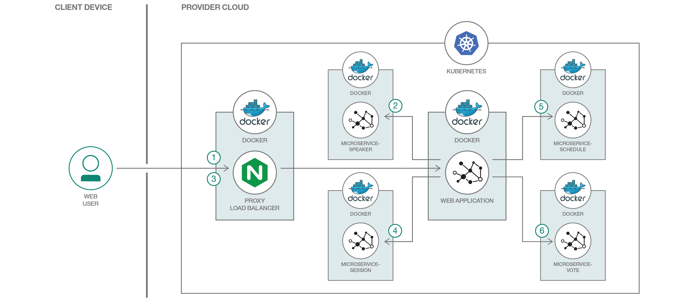
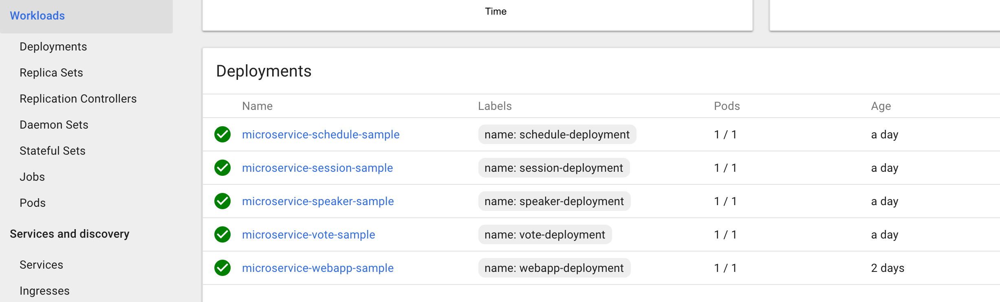
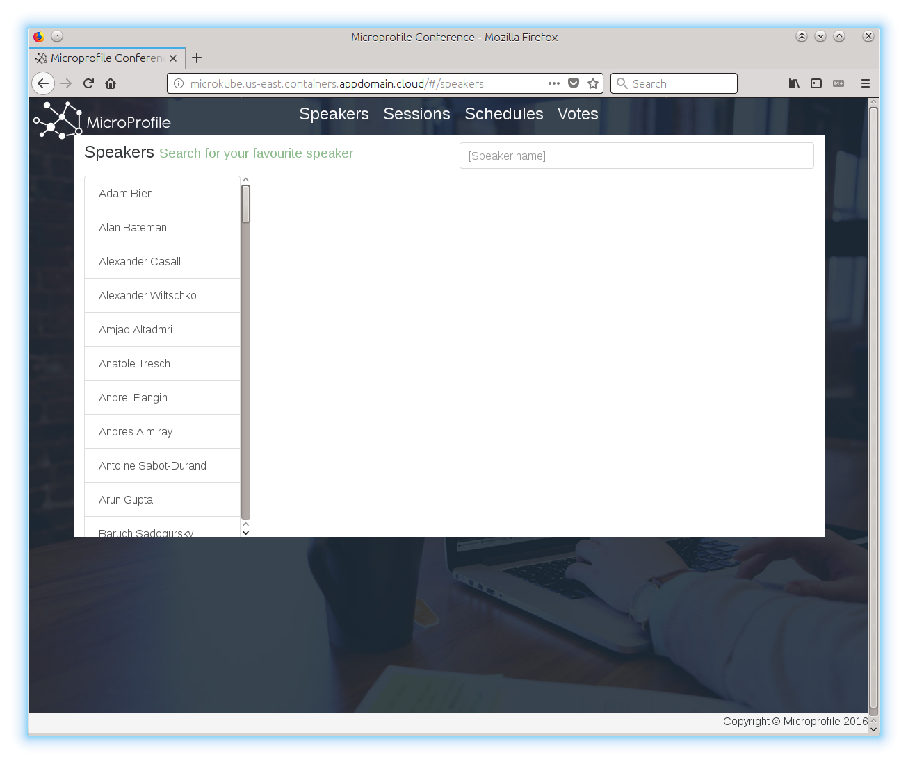
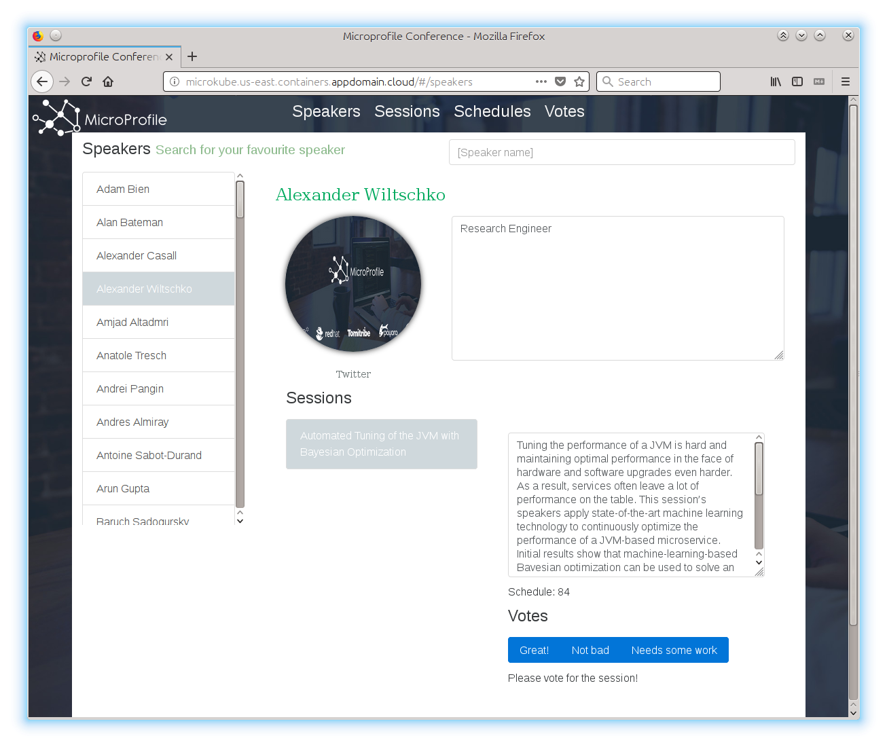
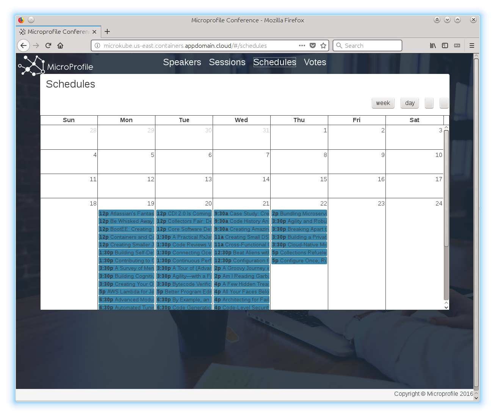
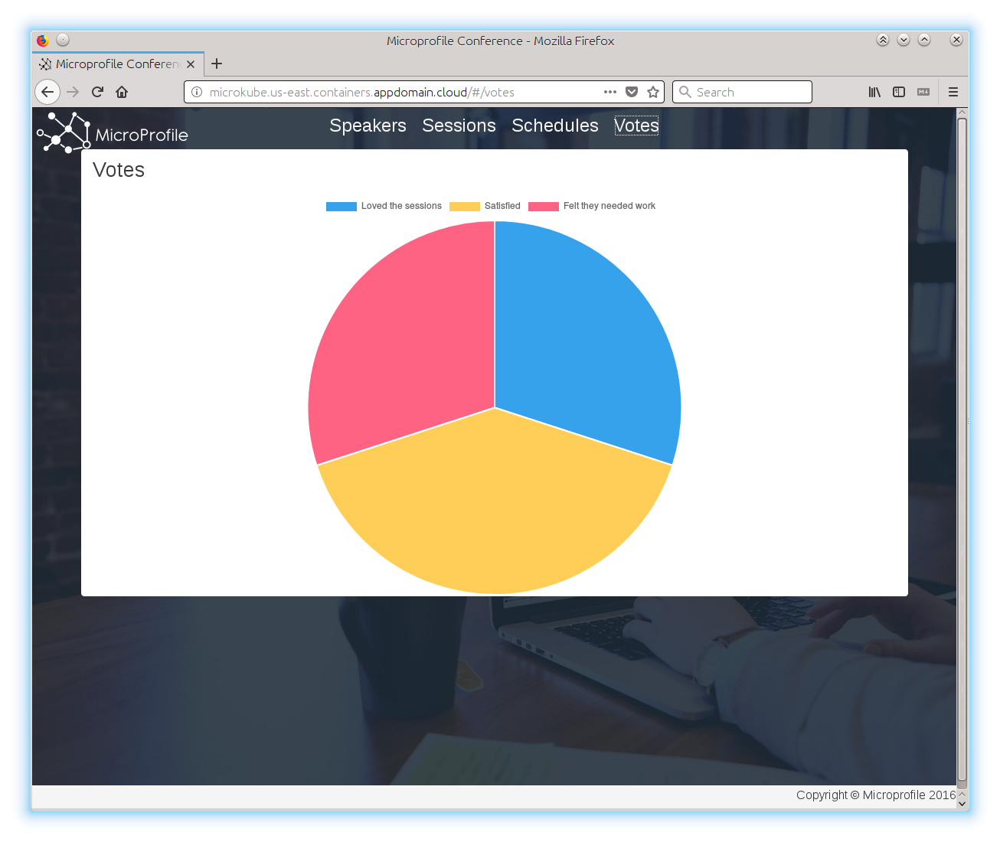
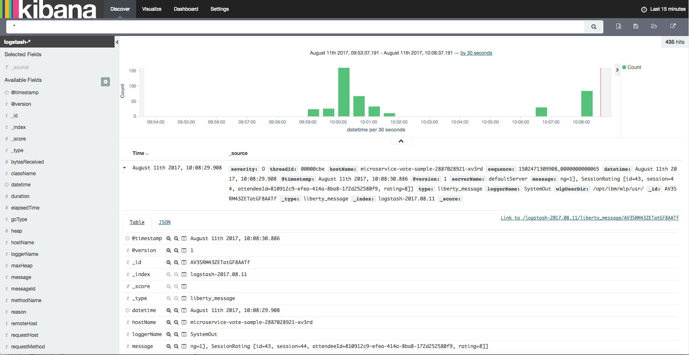

[](https://travis-ci.org/IBM/Java-MicroProfile-on-Kubernetes)

# Deploy MicroProfile based Java microservices on Kubernetes Cluster

*Read this in other languages: [한국어](README-ko.md).*

This code demonstrates the deployment of a Java based microservices application using MicroProfile and Microservice Builder on Kubernetes Cluster.

[MicroProfile](http://microprofile.io) is a baseline platform definition that optimizes Enterprise Java for a microservices architecture and delivers application portability across multiple MicroProfile runtimes. [Microservice Builder](https://developer.ibm.com/microservice-builder/) provides means to develop, test and deploy your microservices using a Java and MicroProfile based programming model and tools.

The Microservice Builder [sample application](https://github.com/WASdev/sample.microservicebuilder.docs) is a web application for managing a conference and is based on a number of discrete microservices. The front end is written in Angular; the backing microservices are in Java. All run on WebSphere Liberty, in Docker containers managed by Kubernetes.



## Included Components
- [Kubernetes Cluster](https://console.ng.bluemix.net/docs/containers/cs_ov.html#cs_ov)
- [MicroProfile](http://microprofile.io)
- [Microservice Builder](https://developer.ibm.com/microservice-builder/)
- [Bluemix DevOps Toolchain Service](https://console.ng.bluemix.net/catalog/services/continuous-delivery)
- [Bluemix Container Service](https://console.ng.bluemix.net/catalog/?taxonomyNavigation=apps&category=containers)

## Prerequisite

* Create a Kubernetes cluster with either [Minikube](https://kubernetes.io/docs/getting-started-guides/minikube) for local testing, or with [IBM Bluemix Container Service](https://github.com/IBM/container-journey-template) to deploy in cloud. For deploying on Minikube follow the instructions [here](https://github.com/WASdev/sample.microservicebuilder.docs/blob/master/dev_test_local_minikube.md)
* The code in this particular repository is regularly tested against [Kubernetes Cluster from Bluemix Container Service](https://console.ng.bluemix.net/docs/containers/cs_ov.html#cs_ov) using Travis.
* Install a Git client to obtain the sample code.


## Deploy to Kubernetes Cluster from Bluemix
If you want to deploy directly to Bluemix, click on 'Deploy to Bluemix' button below to create a Bluemix DevOps service toolchain and pipeline for deploying the Java microservices using MicroProfile sample, else jump to [Steps](#steps)

[](https://console.ng.bluemix.net/devops/setup/deploy/?repository=https://github.com/IBM/Java-MicroProfile-on-Kubernetes)

Please follow the [Toolchain instructions](https://github.com/IBM/container-journey-template/blob/master/Toolchain_Instructions_new.md) to complete your toolchain and pipeline.

## Steps

1. [Install Microservice Builder add-ons](#1-install-microservice-builder-add-ons)
2. [Get and build the application code](#2-get-and-build-the-application-code)
3. [Build application containers](#3-build-application-containers)
4. [Create Services and Deployments](#4-create-services-and-deployments)

# 1. Install Microservice Builder add-ons

First, clone our repository.
```shell
git clone https://github.com/IBM/Java-MicroProfile-on-Kubernetes.git
cd Java-MicroProfile-on-Kubernetes
```

Then, install the 2 add-ons, [Microservice Builder Fabric](https://www.ibm.com/support/knowledgecenter/SS5PWC/fabric_concept.html) and [ELK Sample](https://github.com/WASdev/sample.microservicebuilder.helm.elk/blob/master/sample_elk_concept.md), to collect metrics from the MicroProfile Conference application. 
  
Install [Helm](https://github.com/kubernetes/helm) and use Helm to install the necessary add-ons on your Kubernetes.

```shell
helm init

#Install Fabric
helm repo add mb http://public.dhe.ibm.com/ibmdl/export/pub/software/websphere/wasdev/microservicebuilder/helm/
helm install --name fabric mb/fabric

#Install ELK Sample
helm repo add mb-sample https://wasdev.github.io/sample.microservicebuilder.helm.elk/charts
helm install --name sample-elk mb-sample/sample-elk
```
It will take up to 20 minutes to install the Microservice Builder Add-ons on your Kubernetes Cluster. In the meantime, let's start building our applications and microservices.

> Note: If you don't want to build your own application, you can use our default Docker images and move on to [step 4](#4-create-services-and-deployments).

# 2. Get and build the application code

* Install [Maven](https://maven.apache.org/download.cgi) and a Java 8 JDK.

> **Note:** For the following steps, you can get the code and build the packages by running 
> ```shell
> ./scripts/get_code.sh
> ``` 


* `git clone` and `mvn clean package` the following projects:
   * [Web-App](https://github.com/WASdev/sample.microservicebuilder.web-app)
   ```bash
      git clone https://github.com/WASdev/sample.microservicebuilder.web-app.git
  ```
   * [Schedule](https://github.com/WASdev/sample.microservicebuilder.schedule)
   ```bash
      git clone https://github.com/WASdev/sample.microservicebuilder.schedule.git
  ```
   * [Speaker](https://github.com/WASdev/sample.microservicebuilder.speaker)
   ```bash
      git clone https://github.com/WASdev/sample.microservicebuilder.speaker.git
  ```
   * [Session](https://github.com/WASdev/sample.microservicebuilder.session)
   ```bash
      git clone https://github.com/WASdev/sample.microservicebuilder.session.git
  ```
   * [Vote](https://github.com/WASdev/sample.microservicebuilder.vote)
   ```bash
      git clone https://github.com/WASdev/sample.microservicebuilder.vote.git
  ```

* `mvn clean package` in each ../sample.microservicebuilder.* projects


# 3. Build application containers

Install [Docker CLI](https://www.docker.com/community-edition#/download) and a [Docker](https://docs.docker.com/engine/installation/) engine.

Use the following commands to build and push your microservice containers.

> **Note:** For the following steps, you can build and push the images by running 
> ```shell
> ./scripts/build_and_push_docker_images.sh <docker_namespace>
> ```

Build the web-app microservice container

```bash
docker build -t <docker_namespace>/microservice-webapp sample.microservicebuilder.web-app
docker push <docker_namespace>/microservice-webapp
```

Build the vote microservice container

```bash
docker build -t <docker_namespace>/microservice-vote sample.microservicebuilder.vote
docker push <docker_namespace>/microservice-vote-cloudant
```

Build the schedule microservice container

```bash
docker build -t <docker_namespace>/microservice-schedule sample.microservicebuilder.schedule
docker push <docker_namespace>/microservice-schedule
```

Build the speaker microservice container

```bash
docker build -t <docker_namespace>/microservice-speaker sample.microservicebuilder.speaker
docker push <docker_namespace>/microservice-speaker
```

Build the session microservice container

```bash
docker build -t <docker_namespace>/microservice-session sample.microservicebuilder.session
docker push <docker_namespace>/microservice-session
```

Build the nginx controller

```bash
docker build -t <docker_namespace>/nginx-server nginx
docker push <docker_namespace>/nginx-server
```

# 4. Create Services and Deployments

Get the IP of the node

```bash
$ kubectl get nodes
NAME             STATUS    AGE
10.76.193.96     Ready     23h
```

Change the image name given in the respective deployment YAML files for all the projects in the manifests directory with the newly build image names. Then, set the value of `SOURCE_IP` env variable present in deploy-nginx.yaml file present in manifests folder with the IP of the node. 

Alternatively, you can run the following script to change the image name and SOURCE_IP for all your YAML files.

> If you want to use our default images, use **journeycode** as the *docker_username* when you run the script.

```shell
./scripts/change_image_name_osx.sh <docker_username> #For Mac users
./scripts/change_image_name_linux.sh <docker_username> #For Linux users
```

Before you start deploying your application, make sure the Microservice Builder Add-ons are installed and running.
```shell
$ kubectl get pods --show-all=true
NAME                                    READY     STATUS      RESTARTS   AGE
fabric-zipkin-4284087195-d6s1t          1/1       Running     0          11m
key-retrieval-deploy-gkr9n              0/1       Completed   0          11m  # Make sure this job is completed
kibana-dashboard-deploy-rd0q5           1/1       Running     0          11m 
sample-elk-sample-elk-461262821-rp1rl   3/3       Running     0          11m 
secret-generator-deploy-bj1jj           0/1       Completed   0          11m  # Make sure this job is completed
```

Now, deploy the microservice with the command `kubectl create -f manifests`.

After you have created all the services and deployments, wait for 10 to 15 minutes. You can check the status of your deployment on Kubernetes UI. Run 'kubectl proxy' and go to URL 'http://127.0.0.1:8001/ui' to check when the application containers are ready.




After few minutes the following commands to get your public IP and NodePort number.

```bash
$ bx cs workers <cluster_name>
OK
ID                                                 Public IP      Private IP     Machine Type   State    Status   
kube-hou02-pa817264f1244245d38c4de72fffd527ca-w1   184.173.1.55   10.76.193.96   free           normal   Ready 
$ kubectl get svc nginx-svc
NAME        CLUSTER-IP     EXTERNAL-IP   PORT(S)        AGE
nginx-svc   10.76.193.96   <nodes>       80:30056/TCP   11s
```

Now you can use the link **http://[Public IP]:30056** to access your application on browser and use **http://[Public IP]:30500** to access your Kibana for tracking the metrics.

Web application home page



When you click on speaker name



When you click on schedules link



When you click on vote link



Kibana discover page



## Troubleshooting

* If your microservice instance is not running properly, you may check the logs using
	* `kubectl logs <your-pod-name>`
* To delete a microservice
	* `kubectl delete -f manifests/<microservice-yaml-file>`
* To delete all microservices
	* `kubectl delete -f manifests`
* To delete Microservice Builder add-ons
  	* `helm delete --purge sample-elk`
  	* `helm delete --purge fabric`

## References
* This java microservices example is based on Kubernete's [Microprofile Showcase Application](https://github.com/WASdev/sample.microservicebuilder.docs).

# License
[Apache 2.0](LICENSE)
